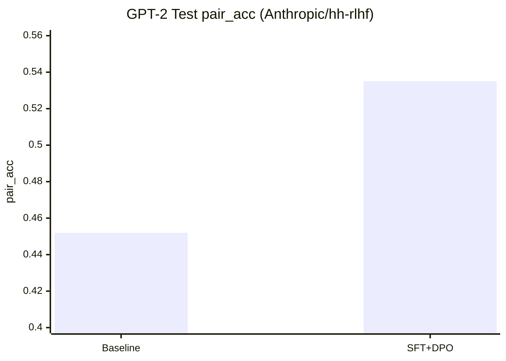
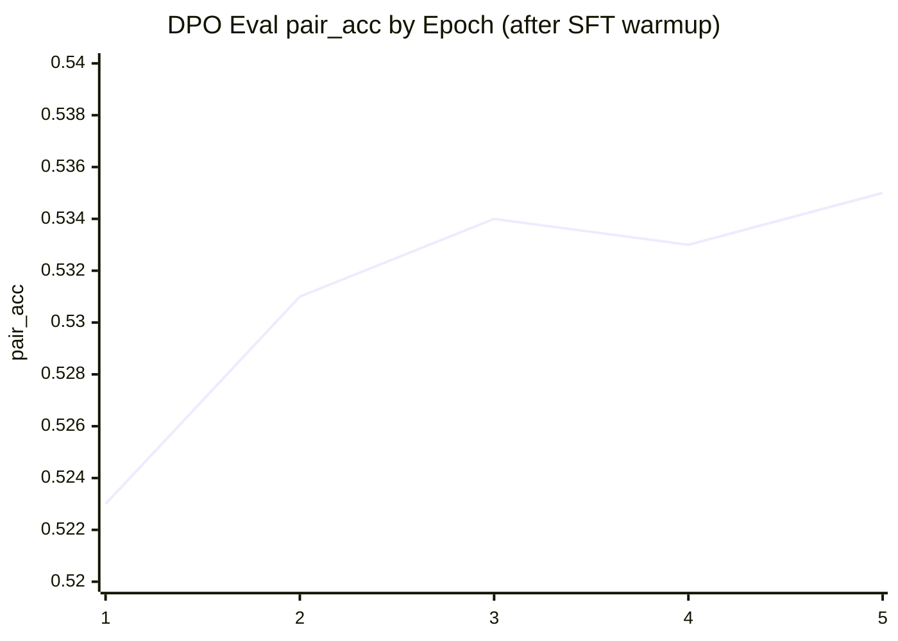

# Simple DPO + KTO on Real Data

This repo contains a minimal training script for:

- `DPO` (Direct Preference Optimization)
- `KTO` (a simple KTO-style objective with desirable/undesirable labels)

Both use a real preference dataset from Hugging Face:
- `Anthropic/hh-rlhf`

## Install

```bash
python -m venv .venv
source .venv/bin/activate
pip install -r requirements.txt
```

## Run DPO

```bash
python train_preference.py \
  --mode dpo \
  --model_name_or_path distilgpt2 \
  --train_samples 2000 \
  --eval_samples 500 \
  --epochs 1 \
  --batch_size 2 \
  --output_dir outputs/dpo-distilgpt2 \
  --save_model
```

### Google Colab (CUDA) recommended

In Colab, set runtime to `GPU` first (`Runtime -> Change runtime type -> T4/A100`), then run:

```bash
python train_preference.py \
  --mode dpo \
  --model_name_or_path distilgpt2 \
  --device cuda \
  --precision fp16 \
  --train_samples 2000 \
  --eval_samples 500 \
  --epochs 1 \
  --batch_size 4 \
  --grad_accum_steps 4 \
  --max_length 384 \
  --output_dir outputs/dpo-colab
```

If you hit OOM, reduce `--batch_size` first, then `--max_length`.

## Run KTO

```bash
python train_preference.py \
  --mode kto \
  --model_name_or_path distilgpt2 \
  --device cuda \
  --precision fp16 \
  --train_samples 2000 \
  --eval_samples 500 \
  --epochs 1 \
  --batch_size 2 \
  --output_dir outputs/kto-distilgpt2 \
  --save_model
```

## Evaluate a Saved Model

Use the saved model as policy and the original base model as reference:

```bash
python train_preference.py \
  --mode dpo \
  --model_name_or_path outputs/dpo-distilgpt2 \
  --ref_model_name_or_path distilgpt2 \
  --eval_only \
  --eval_samples 500 \
  --output_dir outputs/dpo-eval
```

Same idea for KTO:

```bash
python train_preference.py \
  --mode kto \
  --model_name_or_path outputs/kto-distilgpt2 \
  --ref_model_name_or_path distilgpt2 \
  --eval_only \
  --eval_samples 500 \
  --output_dir outputs/kto-eval
```

## Metrics

Saved to `output_dir/metrics.json`.

- `loss`: objective value on eval set
- `pair_acc`: % of pairs where model scores chosen > rejected
- `margin` / `pair_margin`: average (chosen logprob - rejected logprob)
- `dpo_acc`: % of pairs with positive DPO advantage
- `label_acc` (KTO): % correct desirable vs undesirable classification
- `mean_reward`, `desired_reward`, `undesired_reward` (KTO): reward stats vs reference model

## Example Results (gpt2, seed=42)

Run setup:
- Baseline: `gpt2` eval-only on `test` (`eval_samples=1000`)
- Trained: SFT warmup (`sft_epochs=2`) + DPO (`epochs=5`) on `train_samples=16000`

Final test metrics summary:

| Model Stage | pair_acc | margin |
| --- | ---: | ---: |
| Baseline (`eval_only`) | 0.4520 | -0.0700 |
| SFT + DPO | 0.5350 | 0.1228 |
| Delta | +0.0830 | +0.1928 |



Per-epoch eval `pair_acc` during DPO:



## Notes

- This script keeps implementation intentionally small and readable.
- It truncates long samples to `--max_length`.
- KTO uses a simple objective based on reward sign and `--kto_target_kl`.
