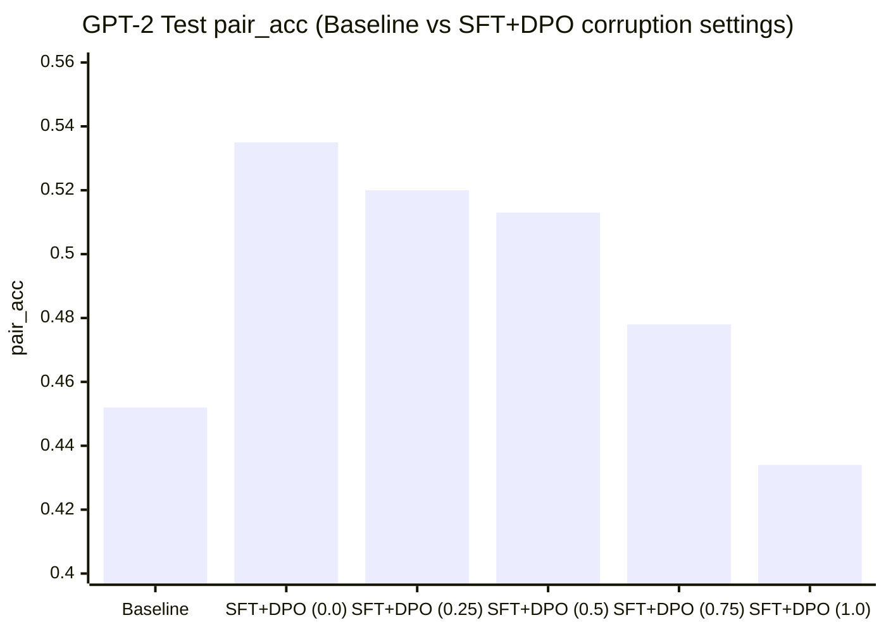
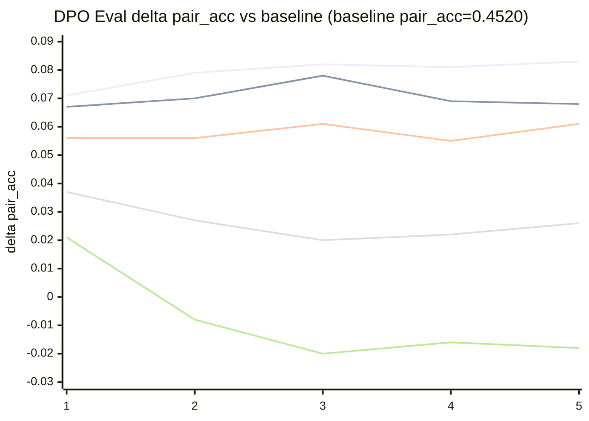

# Simple DPO + KTO on Real Data

This repo contains a minimal training script for:

- `DPO` (Direct Preference Optimization)
- `KTO` (a simple KTO-style objective with desirable/undesirable labels)

Both use a real preference dataset from Hugging Face:
- `Anthropic/hh-rlhf`

## Install

```bash
python -m venv .venv
source .venv/bin/activate
pip install -r requirements.txt
```

## Run DPO

```bash
python train_preference.py \
  --mode dpo \
  --model_name_or_path distilgpt2 \
  --train_samples 2000 \
  --eval_samples 500 \
  --epochs 1 \
  --batch_size 2 \
  --output_dir outputs/dpo-distilgpt2 \
  --save_model
```

### Google Colab (CUDA) recommended

In Colab, set runtime to `GPU` first (`Runtime -> Change runtime type -> T4/A100`), then run:

```bash
python train_preference.py \
  --mode dpo \
  --model_name_or_path distilgpt2 \
  --device cuda \
  --precision fp16 \
  --train_samples 2000 \
  --eval_samples 500 \
  --epochs 1 \
  --batch_size 4 \
  --grad_accum_steps 4 \
  --max_length 384 \
  --output_dir outputs/dpo-colab
```

If you hit OOM, reduce `--batch_size` first, then `--max_length`.

## Run KTO

```bash
python train_preference.py \
  --mode kto \
  --model_name_or_path distilgpt2 \
  --device cuda \
  --precision fp16 \
  --train_samples 2000 \
  --eval_samples 500 \
  --epochs 1 \
  --batch_size 2 \
  --output_dir outputs/kto-distilgpt2 \
  --save_model
```

## Evaluate a Saved Model

Use the saved model as policy and the original base model as reference:

```bash
python train_preference.py \
  --mode dpo \
  --model_name_or_path outputs/dpo-distilgpt2 \
  --ref_model_name_or_path distilgpt2 \
  --eval_only \
  --eval_samples 500 \
  --output_dir outputs/dpo-eval
```

Same idea for KTO:

```bash
python train_preference.py \
  --mode kto \
  --model_name_or_path outputs/kto-distilgpt2 \
  --ref_model_name_or_path distilgpt2 \
  --eval_only \
  --eval_samples 500 \
  --output_dir outputs/kto-eval
```

## Metrics

Saved to `output_dir/metrics.json`.

- `loss`: objective value on eval set
- `pair_acc`: % of pairs where model scores chosen > rejected
- `margin` / `pair_margin`: average (chosen logprob - rejected logprob)
- `dpo_acc`: % of pairs with positive DPO advantage
- `label_acc` (KTO): % correct desirable vs undesirable classification
- `mean_reward`, `desired_reward`, `undesired_reward` (KTO): reward stats vs reference model

## Example Results (gpt2, seed=42)

Run setup:
- Baseline: `gpt2` eval-only on `test` (`eval_samples=1000`)
- Training: SFT warmup (`sft_epochs=2`) + DPO (`epochs=5`) on `train_samples=16000`
- Compared data conditions: `corruption=0.0` vs `corruption=0.25` vs `corruption=0.5` vs `corruption=0.75` vs `corruption=1.0`

Final test metrics summary:

| Condition | pair_acc | margin | delta pair_acc vs baseline |
| --- | ---: | ---: | ---: |
| Baseline (`eval_only`) | 0.4520 | -0.0700 | +0.0000 |
| SFT + DPO (`corruption=0.0`) | 0.5350 | 0.1228 | +0.0830 |
| SFT + DPO (`corruption=0.25`) | 0.5200 | 0.0870 | +0.0680 |
| SFT + DPO (`corruption=0.5`) | 0.5130 | 0.0452 | +0.0610 |
| SFT + DPO (`corruption=0.75`) | 0.4780 | -0.0281 | +0.0260 |
| SFT + DPO (`corruption=1.0`) | 0.4340 | -0.1590 | -0.0180 |



Per-epoch eval improvement over baseline during DPO (overlaid lines):



Legend for the overlaid epoch graph:

| Series | Color indicator | Condition |
| --- | --- | --- |
| Line 1 | <span style="color:#1f77b4;">&#9632; blue (#1f77b4)</span> | `corruption=0.0` |
| Line 2 | <span style="color:#ff7f0e;">&#9632; orange (#ff7f0e)</span> | `corruption=0.25` |
| Line 3 | <span style="color:#2ca02c;">&#9632; green (#2ca02c)</span> | `corruption=0.5` |
| Line 4 | <span style="color:#d62728;">&#9632; red (#d62728)</span> | `corruption=0.75` |
| Line 5 | <span style="color:#9467bd;">&#9632; purple (#9467bd)</span> | `corruption=1.0` |

## Notes

- This script keeps implementation intentionally small and readable.
- It truncates long samples to `--max_length`.
- KTO uses a simple objective based on reward sign and `--kto_target_kl`.
